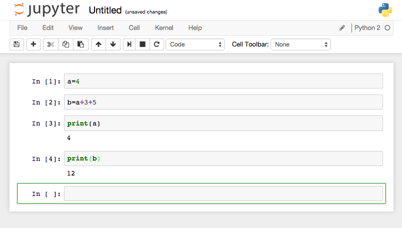

# mynerva
logging Jupyter notebook actions

# Example Setup

**1) Create symbolic links in jupyter's nbextensions directory to mynerva's nbextensions**

`ln -s ~/[path to repo]/mynerva/nbextensions/markcell.js ~/.ipython/nbextensions/markcell.js`

`ln -s ~/[path to repo]/mynerva/nbextensions/print-cell.js ~/.ipython/nbextensions/print-cell.js`

**2) Start the notebook server with run_ipython.sh**

This will start the server in mynerva's notebooks directory, load mynerva's server extention, and pipe the notebook actions to a log file.

**3) Create a notebook**

**4) Activate the client-side notebook extension**

Run the following in the browser terminal to enable the client-side extension:

	IPython.notebook.config.update({
	   "load_extensions": {"print-cell":true}
	})

User actions in the notebook will now be logged in a text file in the logs directory.

# Docker Approach
## Installing Docker on Mac
1. Use [this link](https://github.com/docker/toolbox/releases/download/v1.9.1f/DockerToolbox-1.9.1f.pkg) to install the **Docker Toolbox**
3. Search for `Docker Quickstart Terminal` in Spotlight (control+spacebar or command+spacebar) and run
  * This should open up a new terminal and start the Docker Host Linux VM
  * We will use this terminal to start and stop all Docker containers
4. Once the VM has finished initializing, find your Docker Host IP address 
  * 
5. Open another terminal and edit the `/etc/hosts` file on your local machine
  * Add the Docker Host IP to the file and give it a name `docker-local` this way we won't have to reference it by the IP address anymore
  * ```$ sudo vim /etc/hosts```
  * 

## Start the Mynerva Docker Container
1. Switch back to the terminal containing the Linux VM and Run the container
  * The first time may take a while, since it will be downloading the Docker image from the remote Docker Hub to your local machine
  * ```$ docker run -d -p 8888:8888 --name mynerva aouyang1/mynerva```
  * 
2. Go to [http://docker-local:8888](http://docker-local:8888) once the container is running
3. Any cells executed in any notebook will show up in the console
  * 
  * ```$ docker logs mynerva```
  * 

